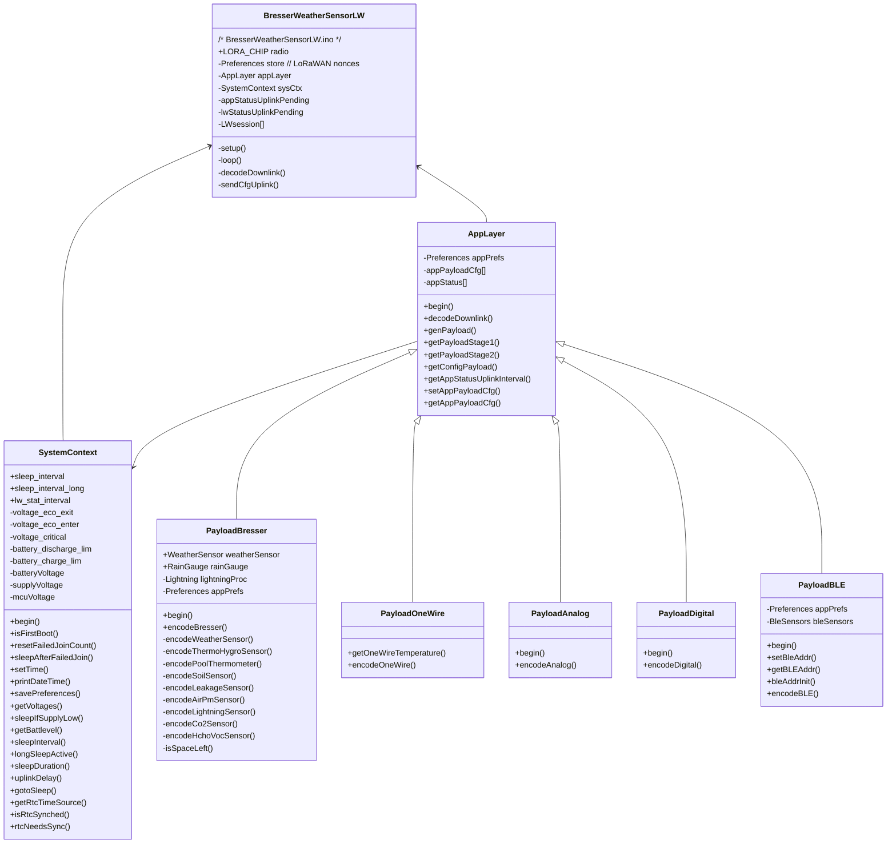

# BresserWeatherSensorLW

[](https://github.com/matthias-bs/BresserWeatherSensorLW/actions/workflows/CI.yml)
[](https://github.com/matthias-bs/BresserWeatherSensorLW/releases)
[](https://github.com/matthias-bs/BresserWeatherSensorLW/blob/main/LICENSE)

Bresser 868 MHz Weather Sensor Radio Receiver based on ESP32/RP2040 and SX1262/SX1276/LR1121 &mdash; sends data to a [LoRaWAN Network](https://lora-alliance.org/)

Moreover, this project provides a base for a generic LoRaWAN device, which transmits sensor data, digital or analog input signals.

This was originally a remake of [BresserWeatherSensorTTN](https://github.com/matthias-bs/BresserWeatherSensorTTN) based on [RadioLib](https://github.com/jgromes/RadioLib) instead of [MCCI Arduino LoRaWAN Library](https://github.com/mcci-catena/arduino-lorawan) for LoRaWAN communication.

## Important Notes

* This should not be the first Arduino sketch you are ever trying to flash to your board - try something simple first (e.g. `blink.ino`) to get familiar with the tools and workflow.
* If you are new to LoRaWAN
   * Check out [The Things Fundamentals on LoRaWAN](https://www.thethingsnetwork.org/docs/lorawan/)
   * Read the excellent article [RadioLib LoRaWAN on TTN starter script](https://github.com/jgromes/RadioLib/blob/master/examples/LoRaWAN/LoRaWAN_Starter/notes.md)
* You need [RadioLib v7.4.0](https://github.com/jgromes/RadioLib/releases/tag/7.4.0) or later
* You need [espressif/arduino-esp32 v3.X.Y](https://github.com/espressif/arduino-esp32)
* Try and configure [BresserWeatherSensorReceiver](https://github.com/matthias-bs/BresserWeatherSensorReceiver) ([examples/BresserWeatherSensorBasic](https://github.com/matthias-bs/BresserWeatherSensorReceiver/tree/main/examples/BresserWeatherSensorBasic)) stand-alone before using it with BresserWeatherSensorLW
* If you previously used [BresserWeatherSensorTTN](https://github.com/matthias-bs/BresserWeatherSensorTTN)
   * The default payload configuration is different
   * LoRaWAN downlink commands (and responses) are different
* [Don't Panic](https://en.wikipedia.org/wiki/Phrases_from_The_Hitchhiker%27s_Guide_to_the_Galaxy#Don't_Panic)

  While the software has quite many configuration options, most users won't need any or just a few. See [Required Configuration](#required-configuration) for the bare minimum configuration (and maybe [Default Parameter Values](#default-parameter-values) & [Default Configuration](#default-configuration)).

## Features

* Single 868 MHz Radio Transceiver for both Sensor Data Reception and LoRaWAN Connection
* Protocols supported by RadioLib
  * LoRaWAN Specification 1.1.0
  * LoRaWAN Specification 1.0.4
  * RP001 Regional Parameters 1.1 revision B
  * RP002 Regional Parameters 1.0.4
* Tested with [The Things Network](https://www.thethingsnetwork.org/), [ChirpStack](https://www.chirpstack.io/) and [Helium IoT](https://www.helium.com/)
* Supports multiple 868 MHz Sensors (e.g. Weather Sensor and Soil Moisture Sensor or Indoor Thermometer/Hygrometer)
* See [BresserWeatherSensorReceiver](https://github.com/matthias-bs/BresserWeatherSensorReceiver) for supported sensors
* Low Power Design (using ESP32 Deep Sleep Mode / RP2040 Sleep State)
* Fast LoRaWAN Joining after Deep Sleep (using ESP32 RTC RAM / RP2040 RAM)
* [ATC MiThermometer](https://github.com/pvvx/ATC_MiThermometer) Bluetooth Low Energy Thermometer/Hygrometer Integration (optional)
* [Theengs Decoder](https://github.com/theengs/decoder) Bluetooth Low Energy Sensors Integration (optional)
* OneWire Temperature Sensor Integration (optional)
* ESP32/RP2040 Analog Digital Converter Integration (optional)
* [A02YYUW / DFRobot SEN0311 Ultrasonic Distance Sensor](https://wiki.dfrobot.com/_A02YYUW_Waterproof_Ultrasonic_Sensor_SKU_SEN0311) (30...4500mm) (optional)
* [Remote Configuration via LoRaWAN Downlink](#remote-configuration-commands--status-requests-via-lorawan)
* Easy [Sensor Data Uplink Payload Configuration](#payload-configuration) 
* Implementation with Separation between LoRaWAN Network Layer and Application Layer for easy Repurposing
* Loading of LoRaWAN Secrets from JSON File on LittleFS (optional)
* Loading of Hardware/Deployment specific Configuration Parameters from JSON file on LittleFS (optional)
* External RTC (with Backup Battery) Integration (optional)
* LoRaWAN Codec API compliant [Uplink/Downlink Payload Formatters](scripts/bresserweathersensorlw-codec/README.md)

## Contents

* [LoRaWAN Uplink Messages](#lorawan-uplink-messages)
  * [Sensor Data Message](#sensor-data-message)
  * [LoRaWAN Node Status Message](#lorawan-node-status-message)
  * [Application Layer / Sensor Status Message](#application-layer--sensor-status-message)
* [Supported Hardware](#supported-hardware)
  * [Predefined Board Configurations](#predefined-board-configurations)
  * [User-Defined Pinout and Radio Chip Configurations](#user-defined-pinout-and-radio-chip-configurations)
  * [User-Defined Battery Voltage Measurement](#user-defined-battery-voltage-measurement)
  * [Real-Time Clock (RTC)](#real-time-clock-rtc)
* [LoRaWAN Network Service Configuration](#lorawan-network-service-configuration)
* [Software Build Configuration](#software-build-configuration)
  * [Required Configuration](#required-configuration)
  * [Optional Configuration](#optional-configuration)
  * [Enabling Debug Output](#enabling-debug-output)
  * [Test Run](#test-run)
* [LoRaWAN Payload Formatters](#lorawan-payload-formatters)
  * [Encoding of Unavailable or Invalid Data](#encoding-of-unavailable-or-invalid-data) 
  * [The Things Network Payload Formatters Setup](#the-things-network-payload-formatters-setup)
* [MQTT Integration](#mqtt-integration)
  * [The Things Network MQTT Integration](#the-things-network-mqtt-integration)
  * [Home Assistant Integration](#home-assistant-integration)
  * [ChirpStack and InfluxDB Integration](#chirpstack-and-influxdb-integration)
* [Datacake Integration](#datacake-integration)
  * [Datacake / The Things Network Setup](#datacake--the-things-network-setup)
  * [Desktop Dashboard](#desktop-dashboard)
  * [Mobile Dashboard](#mobile-dashboard)
* [Remote Configuration Commands / Status Requests via LoRaWAN](#remote-configuration-commands--status-requests-via-lorawan)
  * [Parameters](#parameters)
  * [Using Raw Data](#using-raw-data)
  * [Using the Javascript Uplink/Downlink Formatters](#using-the-javascript-uplinkdownlink-formatters)
* [Scanning for Sensors](#scanning-for-sensors)
* [Loading LoRaWAN Network Service Credentials from File](#loading-lorawan-network-service-credentials-from-file)
* [Loading LoRaWAN Node Configuration from File](#loading-lorawan-node-configuration-from-file)
* [Payload Configuration](#payload-configuration)
  * [Default Configuration](#default-configuration)
  * [Config Helper](#config-helper)
* [Customizing the Application Layer](#customizing-the-application-layer)
  * [AppLayer Programming Interface](#applayer-programming-interface)
* [Implementation](#implementation)
  * [Class Diagram](#class-diagram)
* [Doxygen Generated Source Code Documentation](#doxygen-generated-source-code-documentation)
* [References](#references)
* [Legal](#legal)

## LoRaWAN Uplink Messages

With the default configuration, the device will periodically send 3 different uplink messages. The [LoRaWAN Node Status](#lorawan-node-status) message and the [Application Layer / Sensor Status](#application-layer--sensor-status) message can be disabled by setting the corresponding interval to zero.

### Sensor Data Message

* Payload: see [Default Configuration](#default-configuration)
* Port: 1
* Interval: ~`<sleep_interval>` / `<sleep_interval_long>` (depending on battery voltage); see [Default Parameter Values](#default-parameter-values)

### LoRaWAN Node Status Message

* Payload:

  | Signal                    | description                           | Unit    | Type        | Bytes |
  | ------------------------- | ------------------------------------- | ------- | ----------- | ----- |
  | ubatt_mv                  | Battery Voltage                       | mv      | uint16      |     2 |
  | long_sleep                | Flag: Long sleep time (energy saving) | &mdash; | uint8       |     1 |
  | **PowerFeather specific**                                                                         |
  | usupply_mv                | Supply Voltage (VDC or USB input)     | mv      | uint16      |     2 |
  | isupply_ma                | Supply Current (VDC or USB input)     | mA      | int16       |     2 |
  | isupply_ma                | Battery Current                       | mA      | int16       |     2 |
  | soc                       | Battery State of Charge               | %       | uint8       |     1 |
  | soh                       | Battery State of Health               | %       | uint8       |     1 |
  | battery_cycles            | Estimated Battery Cycles              | &mdash; | uint16      |     2 |
  | batt_time_min             | Estimated time to charge/discharge    | min     | int32       |     4 |
  | batt_temp_c               | Battery Temperature                   | °C      | temperature |     2 |


The data types are implemented in [lora-serialization](https://github.com/thesolarnomad/lora-serialization) and the [Payload Formatters]
(#lorawan-payload-formatters). `int16` and `int32` are extensions in the payload formatter for signed integers (implemented as `uint<16|32>` + offset).

* Port: `CMD_GET_LW_STATUS`
* Interval: `<lw_status_interval>` (uplink frames); see [Default Parameter Values](#default-parameter-values)

### Application Layer / Sensor Status Massage

* Payload: Bresser/BLE Sensor Battery Status (Bitmap)
* Port: `CMD_GET_SENSORS_STAT`
* Interval: `<app_status_interval>` (uplink frames); see [Default Parameter Values](#default-parameter-values)

See [Parameters](#parameters) for more details.


## Supported Hardware

  |  Status       | Setup                                                                                                               | Board (/ Revision)   | Define (Prefix: ARDUINO_) | Radio Module | Notes    |
  | ---------     | ------------------------------------------------------------------------------------------------------------------- | -------------------- | ------------------------- | ------------ | -------- |
  |  :hourglass:  | [LILYGO®TTGO-LORA32 V1](https://github.com/Xinyuan-LilyGo/TTGO-LoRa-Series) | TTGO LoRa32-OLED /<br>TTGO LoRa32 V1 (No TFCard) | TTGO_LORA32_V1 | SX1276 (HPD13A) | -   |
  |  :hourglass:  | [LILYGO®TTGO-LORA32 V2](https://github.com/LilyGO/TTGO-LORA32) | TTGO LoRa32-OLED /<br>TTGO LoRa32 V2             | TTGO_LoRa32_V2 | SX1276 (HPD13A) | For LMIC only: Wire DIO1 to GPIO33 |
  |  :white_check_mark:  |  [LILYGO®TTGO-LORA32 V2.1](https://www.lilygo.cc/products/lora3?variant=42272562282677)    | TTGO LoRa32-OLED /<br>TTGO LoRa32 V2.1 (1.6.1) | TTGO_LoRa32_v21new |  SX1276 (HPD13A) | - |
  |  :white_check_mark:  |  [LILYGO®T3 S3 SX1262](https://lilygo.cc/products/t3s3-v1-0?variant=42586879721653)        | "LilyGo T3-S3" / "Radio-SX1262" | LILYGO_T3S3_SX1262 |  SX1262  | - |
  |  :white_check_mark:  |  [LILYGO®T3 S3 LR1121](https://lilygo.cc/products/t3-s3-lr1121)                            | "LilyGo T3-S3" / "Radio-LR1121" | LILYGO_T3S3_LR1121 |  LR1121  | - |
  |  :hourglass:  | [Heltec Wireless Stick](https://heltec.org/project/wireless-stick/)   | Heltec Wireless Stick     | HELTEC_WIRELESS_STICK  |  SX1276  | - |
  |  :hourglass:  | [Heltec WiFi LoRa 32 V2](https://heltec.org/project/wifi-lora-32/)    | Heltec WiFi LoRa 32(V2)   | HELTEC_WIFI_LORA_32_V2 |  SX1276  | - |
  |  :white_check_mark:  | [Heltec WiFi LoRa 32 V3](https://heltec.org/project/wifi-lora-32-v3/) | Heltec WiFi LoRa 32(V3)   | HELTEC_WIFI_LORA_32_V3 |  SX1262  | - |
  |  :white_check_mark:  | [LoRaWAN_Node](https://github.com/matthias-bs/LoRaWAN_Node)      | FireBeetle-ESP32 | DFROBOT_FIREBEETLE_ESP32 & LORAWAN_NODE     | SX1276 (RFM95W) | -      |
  |  :white_check_mark:  | [DFRobot FireBeetle ESP32 IoT Microcontroller](https://www.dfrobot.com/product-1590.html) with [FireBeetle Cover LoRa Radio 868MHz](https://www.dfrobot.com/product-1831.html) | FireBeetle-ESP32 |  DFROBOT_FIREBEETLE_ESP32 & DFROBOT_COVER_LORA | SX1276 (LoRa1276) | Wiring on the cover: <br>D2 to RESET<br>D3 to DIO0<br>D4 to CS<br>D5 to DIO1 |
  |  :hourglass:  | [Adafruit Feather ESP32S2 with Adafruit LoRa Radio FeatherWing](https://github.com/matthias-bs/BresserWeatherSensorReceiver#adafruit-feather-esp32s2-with-adafruit-lora-radio-featherwing)                                | Adafruit Feather ESP32-S2 | FEATHER_ESP32S2   | SX1276 (RFM95W) | **No Bluetooth available!**<br>Wiring on the Featherwing:<br>E to IRQ<br>D to CS<br>C to RST<br>A to DI01 |
  |  :white_check_mark:  | [Thingpulse ePulse Feather](https://thingpulse.com/product/epulse-feather-low-power-esp32-development-board/) with [Adafruit LoRa Radio FeatherWing](https://www.adafruit.com/product/3231)     | ThingPulse ePulse Feather | THINGPULSE_EPULSE_FEATHER   | SX1276 (RFM95W) | Wiring on the Featherwing:<br>E to IRQ<br>D to CS<br>C to RST<br>A to DI01 |
  |  :white_check_mark:  | [M5Stack Core2](https://docs.m5stack.com/en/core/core2) with [M5Stack Module LoRa868](https://docs.m5stack.com/en/module/lora868)   | M5Core2 | M5STACK_CORE2   | SX1276<br>(RA-01H) | Wiring on the LoRa868 Module: <br>DIO1 to GPIO35<br><br>"M5Unified" must be installed <br>`M5.begin()`is called to control power management<br><br>See [#178](https://github.com/matthias-bs/BresserWeatherSensorLW/issues/178) |
  |  :white_check_mark:  | [ESP32-S3 PowerFeather](https://powerfeather.dev/) with [Adafruit LoRa Radio FeatherWing](https://www.adafruit.com/product/3231)     | ESP32-S3 PowerFeather | ESP32S3_POWERFEATHER | SX1276 (RFM95W) | Wiring on the Featherwing:<br>E to IRQ<br>D to CS<br>C to RST<br>A to DI01<br><br>"PowerFeather-SDK" must be installed<br>`Board.init(BATTERY_CAPACITY_MAH);` is called to control power management<br><br>see [Wiki](wiki/PowerFeather) for additional hints |
  |  :white_check_mark:  | [Adafruit Feather RP2040](https://www.adafruit.com/product/4884) with [Adafruit LoRa Radio FeatherWing](https://www.adafruit.com/product/3231)     | Adafruit Feather RP2040 | ADAFRUIT_FEATHER_RP2040   | SX1276 (RFM95W) | **No Bluetooth available!**<br>**Configuration: Choose an entry with "FS" in section __Flash Size__!**<br>Wiring on the Featherwing:<br>E to IRQ<br>D to CS<br>C to RST<br>A to DI01 |

:hourglass: &mdash; confirmation pending

:white_check_mark: &mdash; confirmed

### Predefined Board Configurations

> [!NOTE]
> By using one of the boards listed in [Supported Hardware](#supported-hardware) and selecting this **Board** / **Board Revision** in the Arduino IDE, you get a working hardware configuration.
 
By selecting a Board and a Board Revision in the Arduino IDE, a define is passed to the preprocessor/compiler. A default configuration is assumed based on this define. If this is not what you need, you have to switch to Manual Configuration.

If you are not using the Arduino IDE, you can use the defines in [Supported Hardware](#supported-hardware) with your specific tool chain to get the same result.

If enabled in the Arduino IDE Preferences ("Verbose Output"), the preprosessor will provide some output regarding the selected configuration, e.g.

```
ARDUINO_ADAFRUIT_FEATHER_ESP32S2 defined; assuming RFM95W FeatherWing will be used
[...]
Radio chip: SX1276
Pin config: RST->0 , IRQ->5 , NSS->6 , GPIO->11
```
### User-Defined Pinout and Radio Chip Configurations

#### Required Information
* Check the board manufacturer's datasheet, pinout specifications and schematic.
* Check the board's pin definitions file (`pins_arduino.h`) in the [arduino-esp32 project](https://github.com/espressif/arduino-esp32/tree/master/variants)

* Which LoRaWAN radio chip is used? SX1262 or SX1276?
* Which pins are used for SPI (SCK, MISO and MOSI)?
* On-board LoRaWAN radio chip:
  * Which GPIO pins are connected to NSS (CSN), RST, IRQ and GPIO?
* Separate LoRaWAN module:
  * Which GPIO pins are available (i.e. otherwise unconnected) for NSS (CSN), RST, IRQ and GPIO?
  * Connect the ESP32 board with the LoRaWAN module according to the selected GPIO pins.
  * Connect the SPI and power supply pins as required.

> [!NOTE]
> Alternative pin names:
> SX1262: IRQ => DIO0, GPIO => BUSY
> SX1276: IRQ => DIO0, GPIO => DIO1 

> [!IMPORTANT]
> With the information above, the source code in both [BresserWeatherSensorReceiver](https://github.com/matthias-bs/BresserWeatherSensorReceiver) and [BresserWeatherSensorLW](https://github.com/matthias-bs/BresserWeatherSensorLW) has to be modified!

#### Board Identification

To find out which `#define` is set for identifying your board:

In the Arduino IDE &mdash;

* In the `File` menu, open `Preferences` and enable the checkbox "Show verbose output during **compile**"
* In the `Tools` menu, select your board (and board variant, if available)
* Compile any sketch (e.g. `Blink`from the Arduino examples)
* Search for a string starting with `-DARDUINO_` in the output window (e.g. `-DARDUINO_FEATHER_ESP32`)

The string which resembles your board name &mdash; without the preceding `-D` &mdash; is the wanted define (e.g. `ARDUINO_FEATHER_ESP32`).

This can be used by the C++ preprocessor to select board specific code, e.g.

```
#if defined(ARDUINO_FEATHER_ESP32)
  // Put Adafruit Feather ESP32 specific code here
#endif
```

#### BresserWeatherSensorReceiver Configuration

In `WeatherSensorCfg.h`:

* Select or create a code section which will actually be used by the C++ preprocessor (`#if defined(<YOUR_BOARD_DEFINE>) ...).
* Set the radio chip according to your hardware by (un-)commenting `USE_SX1262` or `USE_SX1276`.
* Set the pin definitions `PIN_RECEIVER_CS`, `PIN_RECEIVER_IRQ`, `PIN_RECEIVER_GPIO` and `PIN_RECEIVER_RST` according to your hardware.
* Cross check in the compiler log messages if the desired settings are actually used.

#### BresserWeatherSensorLW

In `config.h`:

* Select or create a code section which will actually be used by the C++ preprocessor (`#if defined(<YOUR_BOARD_DEFINE>) ...).
* Set the radio chip according to your hardware defining `LORA_CHIP`.
* Set the pin definitions `#define PIN_LORA_NSS`, `PIN_LORA_RST`, `PIN_LORA_IRQ` and `PIN_LORA_GPIO` according to your hardware.
* Cross check in the compiler log messages if the desired settings are actually used.

#### Provide Feedback

If your setup is working &mdash; congratulations! Be nice and provide your insights to the project to help others!

### User-Defined Battery Voltage Measurement

> [!WARNING]
> Exceeding the allowed supply voltage or analog digital converter (ADC) input voltage range or reversing the polarity will destroy your board! 

#### Overview

While the battery voltage measurement is not crucial for operation, it is still important if the device is powered from a battery.

The battery voltage is used for:
* Providing battery status to the LoRaWAN network server on request
* Battery deep-discharge protection and energy saving (eco) mode
* Monitoring battery status via uplink (e.g. for optimization of transmission interval)

> [!CAUTION]
> **The following section is meant as a general introduction. Actual implementations may vary. Consult you board's documentation for details!**<br>
> The boards used in this project can be supplied by 5V via USB or by another supply voltage via a second power supply connector. Many have an integrated lithium-ion battery charger. A lithium-ion battery has a voltage range of ~2.4...4.2V. The usable voltage range for the board depends on the actual circuit. If a voltage regulator is used (and no voltage converter), the usable battery voltage range is ~3.3...4.2V.

The MCUs used in this project have an integrated ADC with an input voltage range of 0...3.3V. Therefore, the battery voltage has to be reduced by a voltage divider to provide a voltage range suitable for the ADC.

The ADC input circuitry may come in a few different flavors:
1. A voltage divider is directly connected to the battery and to the ADC input
2. Resistors for a voltage divider are present, but solder bridges are required to actually connect them
3. A voltage divider is implemented, but an electronic switch has to be enabled for using it
4. A voltage divider has to be implemented as external circuit

Last, but not least, some boards provide a separate battery monitoring chip.

Only the cases 1 and 2 will be covered here.

(Also see [Wiki: Battery Voltage Measurement](https://github.com/matthias-bs/BresserWeatherSensorLW/wiki/Battery-Voltage-Measurement)).

#### ADC Input Pin and Voltage Divider Ratio

Find the voltage divider and the ADC input pin used for battery voltage measurement (if available) in your board's circuit diagram.

In `BresserWeatherSensorLWCfg.h`:
* Add a code section with your board definition (see [Board Identification](#board-identification)).
* Define `PIN_ADC_IN` with your board specific pin.
* Define `UBATT_DIV` with your voltage divider ratio if it differs from the default value of `0.5`.

The function `getBatteryVoltage()` in [adc.cpp](https://github.com/matthias-bs/BresserWeatherSensorLW/src/adc.cpp) provides the battery voltage. Any board specific implementation should be placed there. `getBatteryVoltage()` returns `0` for any unknown board or a known board with out a default ADC input circuit to indicate that the battery voltage cannot be measured.

#### Real-Time Clock (RTC)

The MCU's built-in RTC provides time and date for scheduling wake-up from sleep mode and for algorithms like rain gauge or lightning counter post-processing.

The internal RTC retains operation while the MCU is in sleep mode. It can be set from different sources:

1. LoRaWAN Network Time

   The `Device_Time_Req` MAC command allows to request the time from the LoRaWAN network service. This is not supported by all LNS (e.g. not available with Helium Network).

2. LoRaWAN Downlink Command

   The command `CMD_SET_DATETIME` (see [Remote Configuration Commands / Status Requests via LoRaWAN](#remote-configuration-commands--status-requests-via-lorawan)) allows to set the RTC manually.

   The time between queuing `CMD_SET_DATETIME` and the RTC actually being set is rather unpredictable due to the LNS's downlink scheduling. Furthermore, a loss of power (e.g. in case of a battery/solar powered node) will reset the MCU's integrated RTC.

3. External RTC

   An external RTC chip with backup battery retains operation independently of the node's power supply. It is initially set when the LoRaWAN node is built (see [RTCSet.ino](extras/RTCSet/RTCSet.ino)).

   A module with an RTC chip supported by the [Adafruit RTClib](https://github.com/adafruit/RTClib) is connected to the 3.3V power supply and to the MCU's I²C bus pins.

> [!IMPORTANT]
> Check if the I²C interface requires additional pull-up resistors.

   If enabled by setting `EXT_RTC` in [BresserWeatherSensorLWCfg.h](BresserWeatherSensorLWCfg.h), the external RTC takes precedence over the LoRaWAN Network Time.

### LoRaWAN Network Service Configuration

Create an account and set up a device configuration in your LoRaWAN network provider's web console, e.g. [The Things Network](https://www.thethingsnetwork.org/).

* LoRaWAN v1.1
* Regional Parameters 1.1 Revision A
* Device class A
* Over the air activation (OTAA)

> [!IMPORTANT]
> Check the maximum permitted payload size and uplink/downlink rate according to your regional parameters and change the configuration if required!
> See [Airtime calculator for LoRaWAN](https://avbentem.github.io/airtime-calculator/ttn/eu868).

## Software Build Configuration

### Required Configuration

* Install the Arduino ESP32 board package in the Arduino IDE
* Select your ESP32 board
* Install all libraries as listed in [package.json](package.json) &mdash; section 'dependencies' &mdash; via the Arduino IDE Library Manager 
* Clone (or download and unpack) the latest ([BresserWeatherSensorLW Release](https://github.com/matthias-bs/BresserWeatherSensorLW/releases))
* Set your LoRaWAN Network Service credentials &mdash; `RADIOLIB_LORAWAN_DEV_EUI`, `RADIOLIB_LORAWAN_NWK_KEY` and `RADIOLIB_LORAWAN_APP_KEY` &mdash; in [secrets.h](secrets.h):

```
// The Device EUI & two keys can be generated on the TTN console

// Replace with your Device EUI
#define RADIOLIB_LORAWAN_DEV_EUI   0x---------------

// Replace with your App Key
#define RADIOLIB_LORAWAN_APP_KEY   0x--, 0x--, 0x--, 0x--, 0x--, 0x--, 0x--, 0x--, 0x--, 0x--, 0x--, 0x--, 0x--, 0x--, 0x--, 0x--

// Put your Nwk Key here
#define RADIOLIB_LORAWAN_NWK_KEY   0x--, 0x--, 0x--, 0x--, 0x--, 0x--, 0x--, 0x--, 0x--, 0x--, 0x--, 0x--, 0x--, 0x--, 0x--, 0x--
```

* Load the sketch [BresserWeatherSensorLW.ino](BresserWeatherSensorLW.ino)
* Compile and Upload

### Optional Configuration

**Header:** [BresserWeatherSensorLWCfg.h](BresserWeatherSensorLWCfg.h).

**Downlink:** see [Remote Configuration Commands](#remote-configuration-commands--status-requests-via-lorawan)

**File**: see [Loading LoRaWAN Node Configuration from File](#loading-lorawan-node-configuration-from-file)

| Parameter              | Description                                                | Header | Downlink | File |
| ---------------------- | ---------------------------------------------------------- |:------:|:--------:|:----:|
| `TZ_INFO` / `timezone` | your time zone                                             |    X   |          |   X  |
| `KNOWN_BLE_ADDRESSES`  | BLE Sensor MAC Addresses                                   |    X   |     X    |      |
| `SLEEP_INTERVAL`<br>`SLEEP_INTERVAL_LONG`<br>`LW_STATUS_INTERVAL`<br>`APP_STATUS_INTERVAL`<br>`WEATHERSENSOR_TIMEOUT` | Timing parameters                                                                            |    X   |     X    |      |
| `en_decoders`          | Enabled sensor decoders<br>(disabling unused decoders saves CPU cycles / energy)        |        |     X    |      |
| `VOLTAGE_CRITICAL`<br>`VOLTAGE_ECO_EXIT`<br>`VOLTAGE_ECO_ENTER`<br>`BATTERY_DISCHARGE_LIM`<br>`BATTERY_CHARGE_LIM` | Battery voltage levels in mV                                                                                    |    X   |          |   X  |
| see header file        | ADC's input pins, dividers and oversampling                |    X   |          |      |
| **PowerFeather specific Configuration**                                                                        |
| `BATTERY_CAPACITY_MAH` /<br>`powerfeather/battery_capacity` | see [https://docs.powerfeather.dev](https://docs.powerfeather.dev)                                                                                  |    X   |          |   X  |
| `PF_TEMPERATURE_MEASUREMENT` / <br>`powerfeather/temperature_measurement` | see [https://docs.powerfeather.dev](https://docs.powerfeather.dev)                                                                                  |    X   |          |   X  |
| `PF_BATTERY_FUEL_GAUGE` / <br>`powerfeather/battery_fuel_gauge` | see [https://docs.powerfeather.dev](https://docs.powerfeather.dev)                                                                                  |    X   |          |   X  |
| `PF_SUPPLY_MAINTAIN_VOLTAGE` / <br>`powerfeather/supply_maintain_voltage` | see [https://docs.powerfeather.dev](https://docs.powerfeather.dev)                                                                                  |    X   |          |   X  |
| `PF_MAX_CHARGE_CURRENT_MAH` / <br>`powerfeather/max_charge_current` | see [https://docs.powerfeather.dev](https://docs.powerfeather.dev)                                                                              |  X   |          |   X  |
| `SOC_CRITICAL`<br>`SOC_ECO_EXIT`<br>`SOC_ECO_ENTER` | Battery state of charge thresholds in % | X |   | X | 
| **M5Stack specific Configuration**                                                                                          |
| `SOC_CRITICAL`<br>`SOC_ECO_EXIT`<br>`SOC_ECO_ENTER` | Battery state of charge thresholds in % | X |   | X | 

### Enabling Debug Output

[Debug Output Configuration in Arduino IDE](Debug_Output.md)

### Test Run

Watch your board's debug output in the serial console and the LoRaWAN communication in your network provider's web console.

## LoRaWAN Payload Formatters

Upload [Uplink Formatter](scripts/uplink_formatter.js) and [Downlink Formatter](scripts/downlink_formatter.js) scripts in your LoRaWAN network service provider's web console to allow decoding / encoding of raw data to / from JSON format.

The npm package [bresserweathersensorlw-codec](https://www.npmjs.com/package/bresserweathersensorlw-codec) is generated from [scripts/bresserweathersensorlw-codec](https://github.com/matthias-bs/BresserWeatherSensorLW/tree/main/scripts/bresserweathersensorlw-codec).

See [The Things Network MQTT Integration and Payload Formatters](https://github.com/matthias-bs/BresserWeatherSensorTTN/blob/main/README.md#the-things-network-mqtt-integration-payload-formatters) and [TS013-1.0.0 Payload Codec API](https://resources.lora-alliance.org/technical-specifications/ts013-1-0-0-payload-codec-api) for more details.

### Encoding of Unavailable or Invalid Data

For various reasons, data can be (temporarily) unavailable or invalid, e.g. due to a sensor radio message reception failure, sensor initialization, or a low sensor battery. The sensor data uplink message has a fixed format (see  [Payload Configuration](#payload-configuration)), therefore it is not possible to simply omit any data. The allowed payload size of a LoRaWAN frame is very small, therefore space should not be wasted by dedicated 'data valid' flags.

As a solution, unavailable/invalid data are encoded as special values &mdash; out of the normal range &mdash; in the data fields. E.g. a humidity value, which is encoded as 8-bit unsigned value with a range of 0 to 100 percent, is encoded as 255 (0xFF) to indicate invalid data. Those special values defined in [BresserWeatherSensorLWCfg.h](BresserWeatherSensorLWCfg.h).

The [Uplink Payload Formatter](scripts/uplink_formatter.js) detects and skips this data, i.e. the JSON output string contains only valid data. This can be changed by setting `SKIP_INVALID_SIGNALS = false`.

### The Things Network Payload Formatters Setup

#### Uplink Formatter

Decode uplink payload (a sequence of bytes) into JSON format, i.e. data structures which are readable/suitable for further processing.

In The Things Network Console:
1. Go to "Payload formatters" -> "Uplink"
2. Select "Formatter type": "Custom Javascript formatter"
3. "Formatter code": Paste [scripts/uplink_formatter.js](scripts/uplink_formatter.js)
4. Apply "Save changes"


> [!NOTE]
> The actual payload depends on the options selected in the Arduino sketch (see [BresserWeatherSensorsLW.cfg](BresserWeatherSensorsLW.cfg)) &mdash; the decoder must be edited accordingly (add or remove data types and JSON identifiers). The configuration dependent part of the decoder can be created with a C++ preprocessor and the Python script [generate_decoder.py](scripts/generate_decoder.py).

#### Downlink Formatter

Encode downlink payload from JSON to a sequence of bytes.

In The Things Network Console:
1. Go to "Payload formatters" -> "Downlink"
2. Select "Formatter type": "Custom Javascript formatter"
3. "Formatter code": Paste [scripts/downlink_formatter.js](scripts/downlink_formatter.js)
4. Apply "Save changes"

## MQTT Integration

### The Things Network MQTT Integration

TTN provides an MQTT broker.
How to receive and decode the payload with an MQTT client -
see https://www.thethingsnetwork.org/forum/t/some-clarity-on-mqtt-topics/44226/2

V3 topic:

`v3/<ttn app id><at symbol>ttn/devices/<ttn device id>/up`

  
v3 message key field jsonpaths:
  
```
<ttn device id> = .end_device_ids.device_id
<ttn app id> = .end_device_ids.application_ids.application_id  // (not including the <at symbol>ttn in the topic)
<payload> = .uplink_message.frm_payload
```  


JSON-Path with Uplink-Decoder (see [scripts/uplink_formatter.js](scripts/uplink_formatter.js))

`.uplink_message.decoded_payload.bytes.<variable>`

### Home Assistant Integration

This solution builds on top of the The Things Network MQTT Integration, but should work is a similar way for other LoRaWAN Network Services.

#### Create a Bridge between TTN MQTT Broker and your Mosquitto MQTT Broker

> [!NOTE]
> This might not be necessary if it is possible to integrate the TTN MQTT Broker in Home Assistant.

Customize and add the following configurations to your `/etc/mosquitto/conf.d/local.conf`:

```
connection bridge-01
address eu1.cloud.thethings.network:8883
remote_username YOUR_TTN_USERNAME
remote_password YOUR_TTN_PASSWORD
try_private false
bridge_cafile /etc/ssl/certs/ISRG_Root_X1.pem
topic # in 1
```

Change `address` as required. The bridge works in both directions, i.e. you can publish and subscribe messages to/from your LoRaWAN node using your local MQTT broker.

#### Home Assistant Configuration

Customize [scripts/home_assistant_configuration.yaml](scripts/home_assistant_configuration.yaml) and add it to your `/homeassistant/configuration.yaml`:

`ws_topic`: TTN LoRaWAN uplink data topic\
`ws_expiry`: The sensor value is set to 'unavailable' `<ws_expiry>` seconds after the last update\
`ws_device`: Common device configuration for all sensors


### ChirpStack and InfluxDB Integration

[ChirpStack and InfluxDB Integration](docs/influxdb_integration/influxdb_integration.md) kindly provided by [Davide D'Asaro](https://github.com/evon800c).

## Datacake Integration

### Datacake / The Things Network Setup

YouTube Video: [Get started for free with LoRaWaN on The Things Network and Datacake IoT Platform](https://youtu.be/WGVFgYp3k3s)

### Desktop Dashboard


### Mobile Dashboard


## Remote Configuration Commands / Status Requests via LoRaWAN

Many software parameters can be defined at compile time, i.e. in [BresserWeatherSensorLWCfg.h](BresserWeatherSensorLWCfg.h). A few [parameters](#parameters) can also be changed and queried at run time via LoRaWAN, either [using raw data](#using-raw-data) or [using Javascript Uplink/Downlink Formatters](#using-the-javascript-uplinkdownlink-formatters).

### Parameters

| Parameter             | Description                                                                 |
| --------------------- | --------------------------------------------------------------------------- |
| <ws_timeout>          | Weather sensor receive timeout in seconds; 0...255                          |
| <sleep_interval>      | Sleep interval (regular) in seconds; 0...65535                              |
| <sleep_interval_long> | Sleep interval (energy saving mode) in seconds; 0...65535                   |
| <lw_status_interval>  | LoRaWAN node status message uplink interval in no. of uplink frames; 0...255; 0: disabled |
| <ubatt_mv>            | Battery voltage in mV                                                       |
| <long_sleep>          | 0: regular sleep interval / 1: long sleep interval (depending on U_batt)    |
| \<epoch\>             | Unix epoch time, see https://www.epochconverter.com/ ( \<integer\> / "0x....") |
| <reset_flags>         | Raingauge reset flags; 0...15 (1: hourly / 2: daily / 4: weekly / 8: monthly) / "0x0"..."0xF" |
| <ws_scantime>         | Bresser sensor scan time in seconds; 0...255 (only for CMD_SCAN_SENSORS)    |
| \<idX\>               | Sensor ID                                                                   |
| \<decoderX\>          | Matching payload decoder                                                    |
| \<typeX\>             | Sensor type                                                                 |
| \<chX\>               | Sensor channel                                                              |
| <data_flagsX>         | Sensor data flags                                                           |
| \<rssi\>              | Sensor radio signal RSSI in dBm (sign inverted)                             |
| <rtc_source>          | Real time clock source; 0x00: GPS / 0x01: RTC / 0x02: LORA / 0x03: unsynched / 0x04: set (source unknown) |
| <sensors_incX>        | Bresser sensor IDs include list; e.g. "0xDEADBEEF"; "0x00000000" => empty list => default values          |
| <sensors_excX>        | Bresser sensor IDs include list; e.g. "0xDEADBEEF"; "0x00000000" => empty list => default values          |
| <max_sensors>         | Max. number of Bresser sensors per receive cycle; 1...8                     |
| <rx_flags>            | Flags for getData(); see [BresserWeatherSensorReceiver](https://github.com/matthias-bs/BresserWeatherSensorReceiver/blob/627d0c68ee9304acb9ecfb5f226e4d7be99467cb/src/WeatherSensor.h#L130) |
| <en_decoders>         | Enabled sensor data decoders; see [BresserWeatherSensorReceiver](https://github.com/matthias-bs/BresserWeatherSensorReceiver/blob/627d0c68ee9304acb9ecfb5f226e4d7be99467cb/src/WeatherSensor.h#L135)
| <ble_active>          | BLE active scan; 1 (active scan) / 0 (passive scan)                         |
| <ble_scantime>        | BLE scan time in seconds; 0...255                                           |
| <ble_addrX>           | BLE sensor MAC addresses; e.g. "DE:AD:BE:EF:12:23"                          |
| \<typeN\>             | Bitmap for enabling Bresser sensors of type \<N\>; each bit position corresponds to a channel,<br>e.g. bit 0 controls channel 0; unused bits can be used to select features |
| \<onewire\>           | Bitmap for enabling 1-Wire sensors; each bit position corresponds to an index |
| \<analog\>            | Bitmap for enabling analog input channels; each bit position corresponds to a channel |
| \<digital\>           | Bitmap for enabling digital input channels in a broader sense &mdash; GPIO, SPI, I2C, UART, ... |
| <typeN_st>            | Bitmap for Bresser sensor type \<N\> battery status; each bit position corresponds to a channel |
| <app_status_interval> | App Layer (sensor status) message uplink interval in no. of uplink frames; 0...255; 0: disabled |
| <onewire_st>          | Bitmap for 1-Wire sensor status; each bit position corresponds to an index |
| <analog_st>           | Bitmap for analog input status; each bit position corresponds to a channel |
| <digital_st>          | Bitmap for digital input channel status |
| <ble_st>              | Bitmap for BLE sensor battery status |

> [!NOTE]
> See [Payload Configuration](#payload-configuration) for more details!

> [!WARNING]
> Confirmed downlinks should not be used! (see [here](https://www.thethingsnetwork.org/forum/t/how-to-purge-a-scheduled-confirmed-downlink/56849/7) for an explanation.)

> [!IMPORTANT]
> To set sensors_inc / sensors_exc to the compile time default configuration, set the first ID in CMD_SET_SENSORS_INC / CMD_SET_SENSORS_EXC to "0x00000000".
> To set the BLE sensor addresses to the compile time default configuration, set the first address in CMD_SET_BLE_ADDR to "00:00:00:00:00:00".


#### Default Parameter Values

* Sleep interval (long): `SLEEP_INTERVAL`, `SLEEP_INTERVAL_LONG`; see [BresserWeatherSensorLWCfg.h](https://github.com/matthias-bs/BresserWeatherSensorLW/blob/3760ae7ea98417d702f97aa62d3a03b0e704f715/BresserWeatherSensorLWCfg.h#L120C9-L120C23)
* `LW_STATUS_INTERVAL`: see [BresserWeatherSensorLWCfg.h](https://github.com/matthias-bs/BresserWeatherSensorLW/blob/3760ae7ea98417d702f97aa62d3a03b0e704f715/BresserWeatherSensorLWCfg.h#L129)
* `APP_STATUS_INTERVAL`: see [BresserWeatherSensorLWCfg.h](https://github.com/matthias-bs/BresserWeatherSensorLW/blob/3760ae7ea98417d702f97aa62d3a03b0e704f715/BresserWeatherSensorLWCfg.h#L132)
* BLE addresses and scan parameters: `BLE_SCAN_TIME`, `BLE_SCAN_MODE`, `KNOWN_BLE_ADDRESSES`; see [BresserWeatherSensorLWCfg.h](https://github.com/matthias-bs/BresserWeatherSensorLW/blob/3760ae7ea98417d702f97aa62d3a03b0e704f715/BresserWeatherSensorLWCfg.h#L307)
* Weather sensor receive timeout: `WEATHERSENSOR_TIMEOUT`; see [BresserWeatherSensorLWCfg.h](https://github.com/matthias-bs/BresserWeatherSensorLW/blob/3760ae7ea98417d702f97aa62d3a03b0e704f715/BresserWeatherSensorLWCfg.h#L135)
* Sensor IDs include/exclude list: `SENSOR_IDS_EXC`/`SENSOR_IDS_INC`; see [WeatherSensorCfg.h](https://github.com/matthias-bs/BresserWeatherSensorReceiver/blob/ff450b68f669fe312af9a3e00ae9736804df12b6/src/WeatherSensorCfg.h#L83)
* Sensor data uplink payload configuration: see [Payload Configuration](#payload-configuration)

### Using Raw Data

| Command                       | Port       | Downlink                                                                  | Uplink         |
| ----------------------------- | ---------- | ------------------------------------------------------------------------- | -------------- |
| CMD_GET_DATETIME              | 0x20  (32) | 0x00                                                                      | epoch[31:24]<br>epoch[23:16]<br>epoch[15:8]<br>epoch[7:0]<br>rtc_source[7:0] |
| CMD_SET_DATETIME              | 0x21  (33) | epoch[31:24]<br>epoch[23:16]<br>epoch[15:8]<br>epoch[7:0]                 | n.a.           |
| CMD_SET_SLEEP_INTERVAL        | 0x31  (49) | sleep_interval[15:8]<br>sleep_interval[7:0]                               | n.a.           |
| CMD_SET_SLEEP_INTERVAL_LONG   | 0x33  (51) | sleep_interval_long[15:8]<br>sleep_interval_long[7:0]                     | n.a.           |
| CMD_SET_LW_STATUS_INTERVAL    | 0x35  (53) | lw_status_interval[7:0]                                                   | n.a.           |
| CMD_GET_LW_CONFIG             | 0x36  (54) | 0x00                                                                      | sleep_interval[15:8]<br>sleep_interval[7:0]<br>sleep_interval_long[15:8]<br>sleep_interval_long[7:0]<br>lw_status_interval[7:0] |
| CMD_GET_LW_STATUS             | 0x38 (56) | 0x00                                                                       | ubatt_mv[15:8]<br>ubatt_mv[7:0]<br>long_sleep[7:0] |
| CMD_GET_APP_STATUS_INTERVAL   | 0x40  (64) | 0x00                                                                      | app_status_interval[7:0] |
| CMD_SET_APP_STATUS_INTERVAL   | 0x41  (65) | app_status_interval[7:0]                                                  | n.a.            |
| CMD_GET_SENSORS_STAT          | 0x42  (66) | 0x00                                                                      | type00_st[7:0]<br>type01_st[7:0]<br>...<br>type15_st[7:0]<br>onewire_st[15:8]<br>onewire_st[7:0]<br>analog_st[15:8]<br>analog_st[7:0]<br>digital_st[31:24]<br>digital_st[23:16]<br>digital_st[15:8]<br>digital_st[7:0]<br>ble_st[15:8]<br>ble_st[7:0] |
| CMD_GET_APP_PAYLOAD_CFG       | 0x46  (70) | 0x00                                                                      | type00[7:0]<br>type01[7:0]<br>...<br>type15[7:0]<br>onewire[15:8]<br>onewire[7:0]<br>analog[15:8]<br>analog[7:0]<br>digital[31:24]<br>digital[23:16]<br>digital[15:8]<br>digital[7:0] |
| CMD_SET_APP_PAYLOAD_CFG       | 0x47  (71) | type00[7:0]<br>type01[7:0]<br>...<br>type15[7:0]<br>onewire[15:8]<br>onewire[7:0]<br>analog[15:8]<br>analog[7:0]<br>digital[31:24]<br>digital[23:16]<br>digital[15:8]<br>digital[7:0] | n.a. |
| CMD_GET_WS_TIMEOUT            | 0xC0 (192) | 0x00                                                                      | ws_timeout[7:0] |
| CMD_SET_WS_TIMEOUT            | 0xC1 (193) | ws_timeout[7:0]                                                           | n.a.            |
| CMD_RESET_RAINGAUGE           | 0xC3 (195) | flags[7:0]                                                                | n.a.            |
| CMD_SCAN_SENSORS              | 0xC4 (196) | ws_scantime[7:0]                                                          | id0[31:24]<br>id0[23:16]<br>id0[15:8]<br>id0[7:0]<br>decoder0[3:0]<br>type0[3:0]<br>ch0[7:0]<br>data_flags0[7:0]<br>rssi0[7:0]<br>... | 
| CMD_GET_SENSORS_INC           | 0xC6 (198) | 0x00                                                                      | sensors_inc0[31:24]<br>sensors_inc0[23:15]<br>sensors_inc0[16:8]<br>sensors_inc0[7:0]<br>... |
| CMD_SET_SENSORS_INC           | 0xC7 (199) | sensors_inc0[31:24]<br>sensors_inc0[23:16]<br>sensors_inc0[15:8]<br>sensors_inc0[7:0]<br>... | n.a. |
| CMD_GET_SENSORS_EXC           | 0xC8 (200) | 0x00                                                                      | sensors_exc0[31:24]<br>sensors_exc0[23:15]<br>sensors_exc0[16:8]<br>sensors_exc0[7:0]<br>... |
| CMD_SET_SENSORS_EXC           | 0xC9 (201) | sensors_exc0[31:24]<br>sensors_exc0[23:16]<br>sensors_exc0[15:8]<br>sensors_exc0[7:0]<br>... | n.a. |
| CMD_GET_SENSORS_CFG           | 0xCA (202) | 0x00                                                                      | max_sensors[7:0]<br>rx_flags[7:0]<br>en_decoders<7:0> |
| CMD_SET_SENSORS_CFG           | 0xCB (203) | max_sensors[7:0]<br>rx_flags[7:0]<br>en_decoders<7:0>                     | n.a.             |
| CMD_GET_BLE_CONFIG            | 0xD0 (208) | 0x00                                                                      | ble_active[7:0]<br>ble_scantime[7:0] |
| CMD_SET_BLE_CONFIG            | 0xD1 (209) | ble_active[7:0]<br>ble_scantime[7:0]                                      | n.a.            |
| CMD_GET_BLE_ADDR              | 0xD2 (210) | 0x00                                                                      | ble_addr0[47:40]<br>ble_addr0[39:32]<br>ble_addr0[31:24]<br>ble_addr0[23:16]<br>ble_addr0[15:8]<br>ble_addr0[7:0]<br>... |
| CMD_SET_BLE_ADDR              | 0xD3 (211) | ble_addr0[47:40]<br>ble_addr0[39:32]<br>ble_addr0[31:24]<br>ble_addr0[23:16]<br>ble_addr0[15:8]<br>ble_addr0[7:0]<br>... | n.a. |


#### The Things Network Examples

##### Example 1: Set SLEEP_INTERVAL to 360 seconds
1. Set port for CMD_SET_SLEEP_INTERVAL to 49
2. Convert interval to hex: 300 = 0x012C
3. Set payload to 0x01 0x2C
4. Send downlink via The Things Network Console


##### Example 2: Set Date/Time

1. Set port for CMD_SET_DATETIME to 33
2. Get epoch (e.g. from https://www.epochconverter.com/hex) (Example: 0x63B2BC32); add an offset (estimated) for time until received (Example: + 64 / 0x40 seconds => 0x63B2BC**7**2) 
3. Set payload to 0x63 0xB2 0xBC 0x72
4. Send downlink via The Things Network Console

### Using the Javascript Uplink/Downlink Formatters

> [!NOTE]
> The command (`"cmd": ...`) may be omitted if it can be derived from the given parameters.

| Command                       | Downlink                                                                  | Uplink                       |
| ----------------------------- | ------------------------------------------------------------------------- | ---------------------------- |
| CMD_GET_DATETIME              | {"cmd": "CMD_GET_DATETIME"}                                               | {"epoch": \<epoch\>}         |
| CMD_SET_DATETIME              | {"epoch": \<epoch\>}                                                      | n.a.                         |
| CMD_SET_SLEEP_INTERVAL        | {"sleep_interval": <sleep_interval>}                                      | n.a.                         |
| CMD_SET_SLEEP_INTERVAL_LONG   | {"sleep_interval_long": <sleep_interval_long>}                            | n.a.                         |
| CMD_SET_LW_STATUS_INTERVAL    | {"lw_status_interval": <lw_status_interval>}                              | n.a.                         |
| CMD_GET_LW_CONFIG             | {"cmd": "CMD_GET_LW_CONFIG"}                                              | {"sleep_interval": <sleep_interval>, "sleep_interval_long": <sleep_interval_long>, "lw_status_interval": <lw_status_interval>} |
| CMD_GET_LW_STATUS             | {"cmd": "CMD_GET_LW_STATUS"}                                              | {"ubatt_mv": <ubatt_mv>, "long_sleep": <long_sleep>} |
| CMD_GET_APP_STATUS_INTERVAL   | {"cmd": "CMD_GET_APP_STATUS_INTERVAL"}                                    | {"app_status_interval": <app_status_interval>} |
| CMD_SET_APP_STATUS_INTERVAL   | {"app_status_interval": <app_status_interval>}                            | n.a.                         |
| CMD_GET_SENSORS_STAT          | {"cmd": "CMD_GET_SENSORS_STAT"}                                           | "sensor_status": {"ble": <ble_stat>, "bresser": [<bresser0_st>, ..., <bresser15_st>]} |
| CMD_GET_APP_PAYLOAD_CFG       | {"cmd": "CMD_GET_APP_PAYLOAD_CFG"}                                        | {"bresser": [\<type0\>, \<type1\>, ..., \<type15\>], "onewire": \<onewire\>, "analog": \<analog\>, "digital": \<digital\>} |
| CMD_SET_APP_PAYLOAD_CFG       | {"bresser": [\<type0\>, \<type1\>, ..., \<type15\>], "onewire": \<onewire\>, "analog": \<analog\>, "digital": \<digital\>} | n.a. |
| CMD_GET_WS_TIMEOUT            | {"cmd": "CMD_GET_WS_TIMEOUT"}                                             | {"ws_timeout": <ws_timeout>} |
| CMD_SET_WS_TIMEOUT            | {"ws_timeout": <ws_timeout>}                                              | n.a.                         |
| CMD_RESET_RAINGAUGE           | {"reset_flags": <reset_flags>}                                            | n.a.                         |
| CMD_SCAN_SENSORS              | {"ws_scantime": <ws_scantime>}                                            | {"found_sensors": [{"id": \<id0\>, "decoder": \<decoder0\>, "type": \<type0\>, "ch": \<ch0\>, "flags": <data_flags0>, "rssi": \<rssi0\>}, ...]}
| CMD_GET_SENSORS_INC           | {"cmd": "CMD_GET_SENSORS_INC"}                                            | {"sensors_inc": [<sensors_inc0>, ..., <sensors_incN>]} |
| CMD_SET_SENSORS_INC           | {"sensors_inc": [<sensors_inc0>, ..., <sensors_incN>]}                    | n.a.                         |
| CMD_GET_SENSORS_EXC           | {"cmd": "CMD_GET_SENSORS_EXC"}                                            | {"sensors_exc": [<sensors_exc0>, ..., <sensors_excN>]} |
| CMD_SET_SENSORS_EXC           | {"sensors_exc": [<sensors_exc0>, ..., <sensors_excN>]}                    | n.a.                         |
| CMD_GET_SENSORS_CFG           | {"cmd": "CMD_GET_SENSORS_CFG"}                                            | {"max_sensors": <max_sensors>, "rx_flags": <rx_flags>, "en_decoders": <en_decoders>} |
| CMD_SET_SENSORS_CFG           | {"max_sensors": <max_sensors>, "rx_flags": <rx_flags>, "en_decoders": <en_decoders>} | n.a.                         |
| CMD_GET_BLE_CONFIG            | {"cmd": "CMD_GET_BLE_CONFIG"}                                             | {"ble_active": <ble_active>, "ble_scantime": <ble_scantime>} |
| CMD_SET_BLE_CONFIG            | {"ble_active": <ble_active>, "ble_scantime": <ble_scantime>}              | n.a.                         |
| CMD_GET_BLE_ADDR              | {"cmd": "CMD_GET_BLE_ADDR"}                                               | {"ble_addr": [<ble_addr0>, ..., <ble_addrN>]} |
| CMD_SET_BLE_ADDR              | {"ble_addr": [<ble_addr0>, ..., <ble_addrN>]}                             | n.a.                         |

#### The Things Network Examples 

##### Example 1: Set SLEEP_INTERVAL to 360 seconds
1. Build payload as JSON string: `{"sleep_interval": 360}` &mdash;
   the correct port is selected automatically
2. Send downlink via The Things Network Console


##### Example 2: Set Date/Time
1. Get epoch (e.g. from https://www.epochconverter.com) (Example: 1692729833); add an offset (estimated) for time until received (Example: + 64 seconds => 16927298**97**) 
2. Build payload as JSON string: {"epoch": 1692729897} 
3. Send downlink via The Things Network Console

## Scanning for Sensors

> [!NOTE]
> The command `CMD_SCAN_SENSORS` allows to gather information about all sensors within range. 

The differences between regular sensor reception and `CMD_SCAN_SENSORS` are:
* Scanning will run for `<ws_scantime>` seconds (as opposed to `ws_timeout`)
* `rx_flags` is set to `DATA_ALL_SLOTS | DATA_COMPLETE` implicitly, i.e. 
   * As many sensors as possible will be received and
   * For weather sensors using the 6-in-1 protocol, both message types have to be received

   before scanning is finished. (Scanning is also stopped when `<ws_scantime>` has expired.)
* The sensor ID filters (include/exclude list) are disabled
* Different information is provided in the uplink message

The number of sensors which can be reported is limited by the LoRaWAN uplink payload size, e.g. with a limit of 51 bytes, a maximum of 6 sensors can be reported. Scanning can be repeated to get another sample (due to a more or less random relation between sensor's start of transmission and start of scan process).

Example uplink (response to `{"ws_scantime": 180}`):
```json
"found_sensors": [
            {
              "ch": 0,
              "decoder": "6-in-1",
              "flags": "0x0c",
              "id": "0x792882a2",
              "rssi": -100,
              "type": "Weather Sensor"
            },
            {
              "ch": 1,
              "decoder": "6-in-1",
              "flags": "0x00",
              "id": "0x22400873",
              "rssi": -52,
              "type": "Pool / Spa Thermometer"
            },
            {
              "ch": 0,
              "decoder": "6-in-1",
              "flags": "0x1f",
              "id": "0x39582376",
              "rssi": -78,
              "type": "Weather Sensor"
            },
            {
              "ch": 0,
              "decoder": "Lightning",
              "flags": "0x00",
              "id": "0x0000eefb",
              "rssi": -107,
              "type": "Lightning Sensor"
            },
            {
              "ch": 1,
              "decoder": "6-in-1",
              "flags": "0x00",
              "id": "0x67566300",
              "rssi": -96,
              "type": "Soil Temperature and Moisture Sensor"
            },
            {
              "ch": 3,
              "decoder": "Leakage",
              "flags": "0x00",
              "id": "0x28966796",
              "rssi": -106,
              "type": "Water Leakage Sensor"
            }
          ]
```

This allows the following actions:
* `rssi`: Improvement of reception
* `type` & `ch`: Identification of sensors
* `type`, `ch`, `flags`: Payload configuration (`CMD_SET_APP_PAYLOAD_CFG`)
* `id`: Configuration of reception filters (include or exclude list; `CMD_SET_SENSORS_INC`/`CMD_SET_SENSORS_EXC`)
* `decoder`: Optimization of execution time by disabling unused decoders (`CMD_SET_SENSORS_CFG`)
* No. of available sensors: Optimization of execution time by adjusting `max_sensors` (`CMD_SET_SENSORS_CFG`)

## Loading LoRaWAN Network Service Credentials from File

> [!NOTE]
> To simplify deployment of a larger number of devices, LoRaWAN credentials can be read from a JSON file. This allows to use the same source code and binary file for a fleet of devices.


If a valid file `secrets.json` exists on LittleFS, the settings defined at compile time (in `secrets.h`) are overridden.

Modify the example [data/secrets.json](data/secrets.json) as required and install it to the board's Flash memory using [earlephilhower/arduino-littlefs-upload](https://github.com/earlephilhower/arduino-littlefs-upload).

> [!WARNING]
> Only very basic validation of the file `secrets.json` is implemented &mdash; check the debug output.

## Loading LoRaWAN Node Configuration from File

> [!NOTE]
> To simplify deployment of a larger number of devices, LoRaWAN node configuration parameters can be read from a JSON file. These parameters are used for hardware or deployment environment specific settings. This allows to use the same source code and binary file for a fleet of devices.

If a valid file `node_config.json` exists on LittleFS, the default settings defined at compile time (in `BresserWeatherSensorCfg.h`) are overridden.
If a parameter cannot be read from the file, its default value will be used.

The following parameters are available:

| Parameter             | Description | Default Value |
| --------------------- | ----------------------------------------------------------------------- | -------------:|
| timezone              | Time Zone<br>see [Time Zone Abbreviations](https://remotemonitoringsystems.ca/time-zone-abbreviations.php) | `"CET-1CEST-2,M3.5.0/02:00:00,M10.5.0/03:00:00"` |
| voltage_eco_exit      | Voltage threshold in mV for leaving eco mode<br>(long sleep interval)  | `3580` |
| voltage_eco_enter     | Voltage threshold in mV for entering eco mode<br>(long sleep interval)  | `3500` |
| voltage_critical      | Voltage threshold in mV for deep-discharge protection<br>(power off)    | `3200` |
| battery_discharge_lim | Discharging voltage limit in mV<br>for battery level estimation         | `3200` |
| battery_charge_lim    | Charging voltage limit in mV<br>for battery level estimation            | `4200` |
| powerfeather/         | PowerFeather specific (see [https://docs.powerfeather.dev](https://docs.powerfeather.dev)) |   |
| &nbsp;&nbsp;battery_capacity      | Battery capacity in mAh<br>(`0`: no battery connected)<br>see [PowerFeather Docs: `init()`](https://docs.powerfeather.dev/sdk/api/mainboard#result-inituint16_t-capacity--0-batterytype-type--batterytypegeneric_3v7) | `0`    |
| &nbsp;&nbsp;supply_maintain_voltage | see [PowerFeather Docs: `setSupplyMaintainVoltage()`](https://docs.powerfeather.dev/sdk/api/mainboard#result-setsupplymaintainvoltageuint16_t-voltage)<br>`0`: not set | `0` |
| &nbsp;&nbsp;max_charge_current | see [PowerFeather Docs: `setBatteryChargingMaxCurrent()`](https://docs.powerfeather.dev/sdk/api/mainboard##result-setbatterychargingmaxcurrentuint16_t-current) | `50` |
| &nbsp;&nbsp;soc_eco_exit  | SOC threshold in % for leaving eco mode<br>(long sleep interval)  | `20` |
| &nbsp;&nbsp;soc_eco_enter | SOC threshold in % for entering eco mode<br>(long sleep interval) | `25` |
| &nbsp;&nbsp;soc_critical  | SOC threshold in % for deep-discharge protection<br>(power off) | `5` |
| &nbsp;&nbsp;temperature_measurement | see [PowerFeather Docs: `enableBatteryTempSense()`](https://docs.powerfeather.dev/sdk/api/mainboard#result-enablebatterytempsensebool-enable) | `true` |
| &nbsp;&nbsp;battery_fuel_gauge      | see [PowerFeather Docs: `enableBatteryFuelGauge()`](https://docs.powerfeather.dev/sdk/api/mainboard#result-enablebatteryfuelgaugebool-enable) | `true` |
| m5stack/         | M5Stack specific (see [https://docs.m5stack.com/en/arduino/m5unified/power_class](https://docs.m5stack.com/en/arduino/m5unified/power_class)) |   |
| &nbsp;&nbsp;soc_eco_exit  | SOC threshold in % for leaving eco mode<br>(long sleep interval)  | `20` |
| &nbsp;&nbsp;soc_eco_enter | SOC threshold in % for entering eco mode<br>(long sleep interval) | `25` |
| &nbsp;&nbsp;soc_critical  | SOC threshold in % for deep-discharge protection<br>(power off) | `5` |

Modify the example [data/node_config.json](data/node_config.json) as required and install it to the board's Flash memory using [earlephilhower/arduino-littlefs-upload](https://github.com/earlephilhower/arduino-littlefs-upload).

> [!WARNING]
> No validation of the file `node_config.json` is implemented &mdash; check the debug output.

## Payload Configuration

### Default Configuration

The default payload configuration is as follows:

| Sensor                    | Signal                          | Unit  | Type        | Bytes |
| ------------------------- | ------------------------------- | ----- | ----------- | ----- |
| **Bresser Sensors**                                                                       |
| Weather                   | Temperature                     | °C    | temperature |     2 |
| Weather                   | Humidity                        | %     | uint8       |     1 |
| Weather                   | Rain Gauge                      | mm    | rawfloat    |     4 |
| Weather                   | Wind Speed (Gusts)              | m/s   | uint16fp1   |     2 |
| Weather                   | Wind Speed (Avg)                | m/s   | uint16fp1   |     2 |
| Weather                   | Wind Direction                  | °     | uint16fp1   |     2 |
| Weather                   | UV Index                        | -     | uint8fp1    |     1 |
| Weather                   | Post-processed: Hourly Rain     | mm    | rawfloat    |     4 |
| Weather                   | Post-processed: Daily Rain      | mm    | rawfloat    |     4 |
| Weather                   | Post-processed: Weekly Rain     | mm    | rawfloat    |     4 |
| Weather                   | Post-processed: Monthly Rain    | mm    | rawfloat    |     4 |
| Temperature/Humidity      | Temperature                     | °C    | temperature |     2 |
| Temperature/Humidity      | Humidity                        | %     | uint8       |     1 |
| Soil Moisture/Temperature | Temperature                     | °C    | temperature |     2 |
| Soil Moisture/Temperature | Moisture                        | %     | uint8       |     1 |
| Lightning                 | Post-processed: Event timestamp | epoch | unixtime    |     4 |
| Lightning                 | Post-processed: No. of events   | -     | uint16      |     2 |
| Lightning                 | Post-processed: Storm distance  | km    | uint8       |     1 |
| **1-Wire Sensors**                                                                        |
| Temperature               | Temperature                     | °C    | temperature |     2 |
| **Analog Interface**                                                                      |
| Ch 00                     | Battery voltage                 | mV    | uint16      |     2 |
| **Digital Interface**                                                                     |
| &mdash; none &mdash;                                                                      |
| **BLE Sensors**                                                                           |
| Temperature/Humidity      | Temperature                     | °C    | temperature |     2 |
| Temperature/Humidity      | Humidity                        | %     | uint8       |     1 |

The data types are implemented in [lora-serialization](https://github.com/thesolarnomad/lora-serialization) and the [Payload Formatters](#lorawan-payload-formatters). `uint16fp1` and `uint8fp1` are extensions in the payload formatter for fixed-point numbers with 1 decimal.

The default sensor data uplink configuration is defined in https://github.com/matthias-bs/BresserWeatherSensorLW/blob/cb918c6f17e2ef4f6e3f01d1cbb4b6a2c4e21089/BresserWeatherSensorLWCfg.h#L313 as a set of byte values, which are used in https://github.com/matthias-bs/BresserWeatherSensorLW/blob/cb918c6f17e2ef4f6e3f01d1cbb4b6a2c4e21089/src/AppLayer.h#L71 to define the array `appPayloadCfgDef[APP_PAYLOAD_CFG_SIZE]`. This array is used as a large bitmap, where each byte represents a specific sensor or interface and each bit corresponds to a channel or feature.

### Config Helper

Changing the configuration by setting bitmaps is not really comfortable. Therefore the Config Helper has been created.


[Config Helper](https://matthias-bs.github.io/BresserWeatherSensorLW/confighelper.html)

In the Config Helper, you select the desired sensors/interfaces and the used channels/features and generate
1. A bitmap to change the default payload configuration in the C++ source code
2. A JSON string to configure the node via LoRaWAN downlink with the command [CMD_SET_APP_PAYLOAD_CFG](#using-the-javascript-uplinkdownlink-formatters)
3. A JSON string to configure the [Uplink Payload Formatter](#lorawan-payload-formatters)

> [!NOTE]
> You do not have to modify the source code if you apply the configuration via LoRaWAN downlink!

## Customizing the Application Layer

By replacing the Application Layer with your own code, you can use this project as a starting point for your own purpose.

Use [extras/customization/AppLayerMinimal.h](extras/customization/AppLayerMinimal.h) and [extras/customization/AppLayerMinimal.cpp](extras/customization/AppLayerMinimal.cpp) as a template.

### AppLayer Programming Interface

#### Constructor

In [BresserWeatherSensorLW.ino](blob/main/BresserWeatherSensorLW.ino), the `appLayer` object is created:
```
/// Application layer
AppLayer appLayer(&sysCtx);
```

The following constructor must be implemented by the AppLayer class:
```
/*!
 * \brief Constructor
 *
 * \param sysCtx System Context object
 */
AppLayer(SystemContext* sysCtx);
```
#### begin()

`appLayer.begin()` is called in [BresserWeatherSensorLW.ino: setup()](blob/main/BresserWeatherSensorLW.ino) shortly after getting the RTC time. It can be used for any initialization which cannot be done in the constructor.
A typical use case would be initialization of sensors which need a certain time to 'warm up' or acquire data. Other sensors/circuits should be started at the latest possible stage to save energy.

```
/*!
 * \brief AppLayer initialization
 */
void begin(void);
```

#### getPayloadStage1() and getPayloadStage2()

Both functions provide the sensor data as uplink message payload to the LoRaWAN network layer. The parameter `port` can be used to distinguish between different kinds of messages.

Using the `LoraEncoder` object from [lora-serialization](https://github.com/thesolarnomad/lora-serialization) allows to encode common C++ data types as a sequence of bytes for transmission via LoRaWAN. Since the maximum permitted message payload size is very limited, the encoding must use as few bytes as possible.

getPayload

```
/*!
 * \brief Prepare / get payload at startup
 *
 * Use this if
 * - A sensor needs some time for warm-up or data acquisition
 * - The data acquisition has to be done directly after startup
 * - The radio transceiver is used for sensor communication
 *   before starting LoRaWAN activities
 *
 * \param port LoRaWAN port
 * \param encoder uplink encoder object
 */
void getPayloadStage1(uint8_t &port, LoraEncoder &encoder);

/*!
 * \brief Get payload before uplink
 *
 * Use this if
 * - The radio transceiver is NOT used for sensor communication
 * - The sensor preparation has been started in stage1
 * - The data aquistion has to be done immediately before uplink
 *
 * \param port LoRaWAN port
 * \param encoder uplink encoder object
 */
void getPayloadStage2(uint8_t &port, LoraEncoder &encoder);
```

#### decodeDownlink()

If `node.sendReceive()` provided a downlink message, the LoRaWAN network layer tries to decode it. If this fails &mdash; because according to `port`, it is not directed at the network layer &mdash; the message is passed to the ApplicationLayer via `appLayer.decodeDownlink()`.

```
/*!
 * \brief Decode app layer specific downlink messages
 *
 * \param port downlink message port
 * \param payload downlink message payload
 * \param size payload size in bytes
 *
 * \returns config uplink request or 0
 */
uint8_t decodeDownlink(uint8_t port, uint8_t *payload, size_t size);
```

#### getConfigPayload()

A non-zero return value of `decodeDownlink()` triggers execution of `getConfigPayload()`. `getConfigPayload()` passes the uplink message payload and the required uplink port to the LoRaWAN network layer.
```
/*!
 * \brief Get configuration data for uplink
 *
 * Get the configuration data requested in a downlink command and
 * prepare it as payload in an uplink response.
 *
 * \param cmd command
 * \param port uplink port
 * \param encoder uplink data encoder object
 */
void getConfigPayload(uint8_t cmd, uint8_t &port, LoraEncoder &encoder);
```

#### getAppStatusUplinkInterval()

If implemented, status messages originating from the AppLayer can be sent as uplink periodically. The return value of `getAppStatusUplinkInterval()` is used by the LoRaWAN network layer to decide when such a message is due.

```
/*!
 * \brief Get sensor status message uplink interval
 *
 * \returns status uplink interval in frame counts (0: disabled)
 */
uint8_t getAppStatusUplinkInterval(void);
```
    
## Implementation

### Class Diagram


<!--  -->


## Doxygen Generated Source Code Documentation

[https://matthias-bs.github.io/BresserWeatherSensorWL/index.html](https://matthias-bs.github.io/BresserWeatherSensorLW/)

## References

Based on
* [BresserWeatherSensorReceiver](https://github.com/matthias-bs/BresserWeatherSensorReceiver) by Matthias Prinke
* [RadioLib](https://github.com/jgromes/RadioLib) by Jan Gromeš
* [Lora-Serialization](https://github.com/thesolarnomad/lora-serialization) by Joscha Feth
* [OneWireNg](https://github.com/pstolarz/OneWireNg) by Piotr Stolarz
* [DallasTemperature / Arduino-Temperature-Control-Library](https://github.com/milesburton/Arduino-Temperature-Control-Library) by Miles Burton
* [NimBLE-Arduino](https://github.com/h2zero/NimBLE-Arduino) by h2zero
* [Theengs Decoder](https://github.com/theengs/decoder) by [Theengs Project](https://github.com/theengs)
* [DistanceSensor_A02YYUW](https://github.com/pportelaf/DistanceSensor_A02YYUW) by Pablo Portela
* [Preferences](https://github.com/vshymanskyy/Preferences) by Volodymyr Shymanskyy
* [RTClib](https://github.com/adafruit/RTClib) by Adafruit 

## Legal

> This project is in no way affiliated with, authorized, maintained, sponsored or endorsed by Bresser GmbH or any of its affiliates or subsidiaries.
