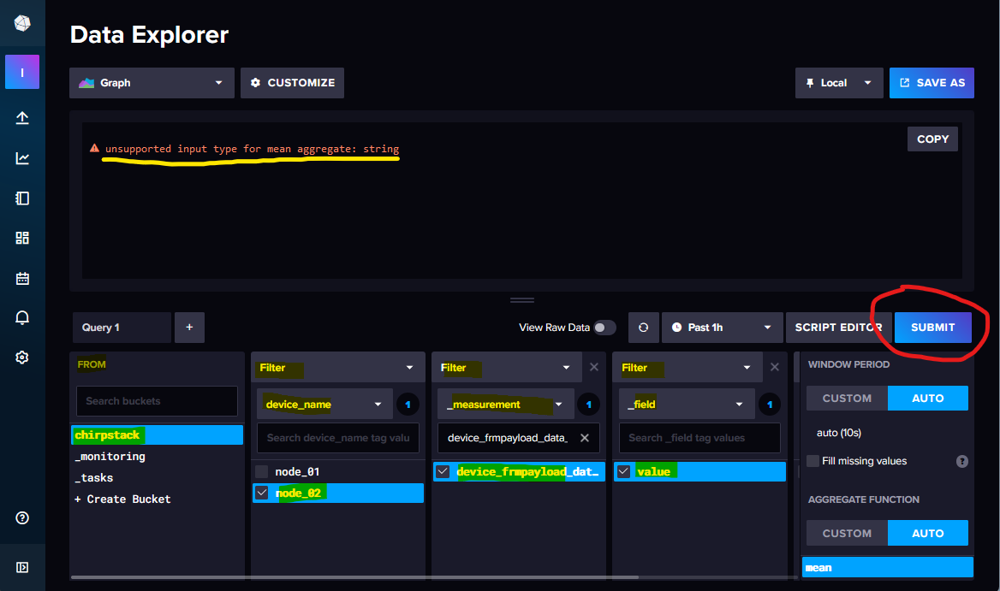

# ChirpStack and InfluxDB Integration

by [Davide D'Asaro](https://github.com/evon800c)

## Introduction

I don’t know if my experience with LoRaWAN and my personal use of the BresserWeatherSensorLW project is interesting for anyone, but I am happy to share what I have realized for my experiment.

LoRa and LoRaWAN and all other components that I have decided to use were completely new to me. My approach was very basic and I think that my description is not useful for advanced users. I think that it could be useful for users who are now starting the trip into this world.

When we start talking about LoRaWAN, we should also talk about its fundamental elements. 
Some note from https://www.thethingsnetwork.org/docs/lorawan/architecture/

- Network Server
- Gateway
- Device
- Application Server

Instead of using a public LoRaWAN network (as for example TTN), I have decided to implement my personal, private one.

### Network Server

To implement a LoRaWAN Network Server, I have decided to use ChirpStack (https://www.chirpstack.io) installed on a virtual machine in my lab environment.
ChirpStack is an open source solution to implement a LoRaWAN Network Server. Documentation is available, clear and simple, so it is not necessary to explain it here.

### Gateway

It is necessary to choose a solution that covers your personal needs.
For my personal needs, I have decided to use a Raspberry PI 4 with RAK2245 PI HAT and ChirpStack Gateway OS (https://www.chirpstack.io/docs/chirpstack-gateway-os/index.html).
Also in this case, documentation is quite simple and clear.

### Device

I have used a "Heltec wifi LoRa 32 v3" board, but for Matthias' **BresserWeatherSensorLW** firmware, each compatible hardware listed in the initial project documentation can be a good choice.

After initial configuration of the LoRaWAN Network Server and in **BresserWeatherSensorLW** code, we can flash the board. If everything goes right, you can see data (such as air temp, but not only that) on the LoRaWAN Network Server console coming as uplink from the device.

### Application Server

Now we can speak about the Application Server.
I have decided to use InfluxDB to store my data as timeseries. So an InfluxDB server will assume the Application Server role (you can have multiple application servers based on your needs).
We need to install an InfluxDB server, and at https://docs.influxdata.com/influxdb/v2/install/ we can choose the InfluxDB installation that we prefer and find all information required to do that.

After InfluxDB installation, we need to configure: Organization, Bucket and Token.

In the images below, you can see how do this.

#### Create Organization and Bucket

#### Create API Token

Now, we have all elements and parameters, including the URL to access the management API, needed for next step.

>  [!NOTE]
> Each public LoRaWAN Network Provider offers some specific interface and features to connect to an Application Server. Also ChirpStack (as a LoRaWAN Network Server) is not different. What I'm going to write will cover a large amount of situations, I think.

For integrating ChirpStack and InfluxDB we need to:

#### Create an Application in ChirpSTack

#### Create a Connection in ChirpStack to the Application Server (InfluxDB in our case)

This can be done using a small number of simple parameters, such as:

- InfluxDB version 
- API endpoint (write) &rarr; http://InfluxDB:8086/api/v2/write (as example)
- Organization (defined on InfluxDB side) &rarr; in my case "labnet"
- Bucket       (defined on InfluxDB side) &rarr; in my case "ChirpStack"
- Token        (defined on InfluxDB side)

Now, ChirpStack writes data coming from the device into InfluxDB.

## Exploring Data inside InfluxDB

At this point, my first challenge was to understand how to explore data in InfluxDB.

From the left column, switch to 'Organization' created before:

Always from the left column on icon "arrow up", click on the 'Buckets' label and select the bucket created before (mybucket).

Now, a data exploration interface is presented. Here we will be guided through the query construction.

From left to right, you can select parameters for the query &mdash; in my case: 
+ From:		chirpstack
+ Filter:	device_name &rarr; and select device name create on LoRaWan console
+ Filter:	_measurement &rarr; device_frmpayload_data_bytes_air_temp_c - the name defined by Matthias code (for air temp)
+ Filter:	_field &rarr; value

Now click on 'Submit' button.

I suppose that you receive an error `unsupported input type for mean aggregate: string`, too. If so, near the "Submit" button, click on "Script Editor". Now you switch to the manual query writer and you can see the query code that you write. 
The issue is caused by the data type, which initially is string insteat of float.

To be able to represent data in a "graph" visualization type, you need to cast the data from string to float, so add "|> toFloat()" as shown below and click the 'Submit' button.

This is the first simple query that I have written.

If you want, you can save your query and visualization (graph) in a dashboard. If you don't have any dashboard, you can create one on the fly. 
On the same dashboard, you can add all visualizations/queries that you want. 

From the dashboard, you can select the time frame that you need to analyze.

